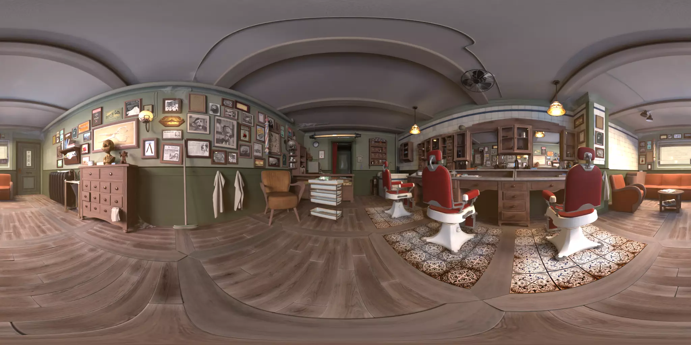
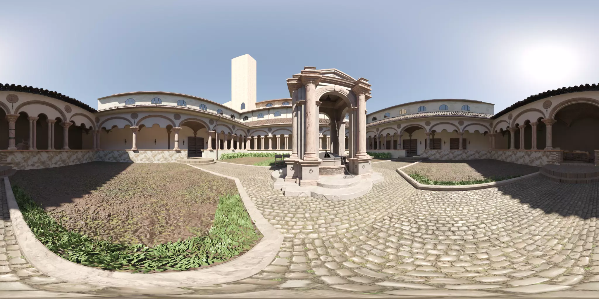
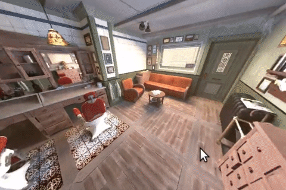
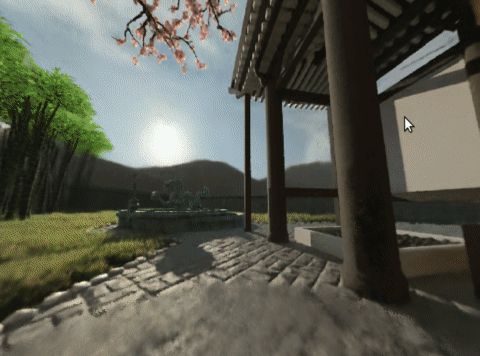

# [SILVR: A Synthetic Immersive Large-Volume Plenoptic Dataset](https://idlabmedia.github.io/large-lightfields-dataset)

We present a dataset _SILVR_ of light field images for six-degrees-of-freedom
navigation in large fully-immersive volumes. The _SILVR_ dataset is short for
_"**S**ynthetic **I**mmersive **L**arge-**V**olume **R**ay"_ dataset.

## Properties
Our dataset exhibits the following properties:

 - **synthetic**: Rendered using Blender 3.0 with Cycles, the images are
   perfect and do not need any calibration. Camera positions and lens
   configurations are known exactly and provided in the corresponding JSON
   files.
 - **large interpolation volume**: The used camera configurations span a
   relative large volume (a couple of meters in diameter).
 - **large field of view**: In order to maximize the _interpolation volume_
   (a.k.a: the walkable volume of light), the images are rendered using fisheye
   lenses with a field of view of 180°.
 - **immersive**: Thanks to the large field of view and positioning of the
   viewpoints has every point within the interpolation volume a full panoramic
   field of view of light information available.
 - **realism**: The selected scenes have reasonable realism.
 - **depth maps**: As the images are computer-genereted renders, we provide
   depth maps for every image.
 - **specularities** and **reflections**: The scenes exhibit some speculars or
   reflections, including mirrors. Reflections and mirrors always have the
   depth of the surface, and not apparent depth of the reflections.
 - **volumetrics**: Some volumetrics are also present (fire, smoke, fog) in the
   `garden` scene.
 - **densly rendered**: The camera setup is rather dense (around 10cm spacing
   between cameras).

## Scenes

We present light field renders with various camera setup configurations for three scenes: _Agent 327: Barbershop_, _Zen Garden_, and _Lone Monk_.

### Agent 327: Barbershop



This scene is taken from [the Blender website, under the "demo files"
section](https://www.blender.org/download/demo-files/#cycles). It is licensed
CC-BY, by [Blender Foundation](https://studio.blender.org).

Download the original _Agent 327: Barbershop_ scene **with light field camera setups** [here (272MB)](https://cloud.ilabt.imec.be/index.php/s/anFWqc5TwW646Ex).
Note that our [Blender Lightfield Addon](https://github.com/IDLabMEDIA/blender-lightfield-addon) is required to open the Blender file with light fields.

### Zen Garden


This scene is made in-house by IDLab-MEDIA. It is licensed [CC-BY 4.0](https://creativecommons.org/licenses/by/4.0/).

Download the _Zen Garden_ scene **with light field camera setups** [here (231MB)](https://cloud.ilabt.imec.be/index.php/s/TTBDMbSziDgFyR7).
Note that our [Blender Lightfield Addon](https://github.com/IDLabMEDIA/blender-lightfield-addon) is required to open the Blender file with light fields.

### Lone Monk



This scene is made by Carlo Bergonzini from [Monorender](http://www.monorender.com/), licensed CC-BY.
The original scene is also available for download from [the Blender website, under the "demo files"
section](https://www.blender.org/download/demo-files/#cycles).
Applied modifications:
 - Added roof geometry above the section with the chair.
 - Solidify modifier on the roof tiles.

Download the modified _Lone Monk_ scene **with light field camera setups** [here (33MB)](https://cloud.ilabt.imec.be/index.php/s/wTwwPyD8pp4CQkp).
Note that our [Blender Lightfield Addon](https://github.com/IDLabMEDIA/blender-lightfield-addon) is required to open the Blender file with light fields.

## Download

Files are available for download from our own [storage service](https://cloud.ilabt.imec.be/index.php/s/KHWopdXmT3Dxo5P).
All files can be downloaded individually. Below you can find an overview of the different files and their sizes.

```
 - Barbershop
   - barbershop_LFCuboid_1mx3mx1m.tar       (16    GB)
   - barbershop_LFSphere_e105cm_d145cm.tar  ( 7.5  GB)
   - barbershop_LFSphere_e110cm_d100cm.tar  (    43MB)
   - barbershop_LFCuboid_8panos.tar         (   172MB)
 - Garden
   - garden_LFCuboid_2x2x1.tar              (25    GB)
   - garden_LFSphere_e100cm_d170cm.tar      ( 8.7  GB)
   - garden_LFSphere_e100cm_d50cm.tar       (    51MB)
   - garden_LFCuboid_8panos.tar             (    86MB)
 - Lone Monk
   - lone_monk_LFCuboid_4mx4mx3m.tar        (24    GB)
   - lone_monk_LFSphere_e220cm_d400cm.tar   ( 6.8  GB)
   - lone_monk_LFSphere_e160cm_d220cm.tar   (   500MB)
   - lone_monk_LFCuboid_8panos.tar          (   159MB)
```

Find the sha256 checksums [here](./sha256sums.txt).
The letters `e` and `d` in the filenames are for 'elevation' and 'diameter'.

## Tools

### [Lens Reproject](https://github.com/IDLabMEDIA/image-lens-reproject)
As the images are rendered using equisolid fish-eye lenses, we also supply a
tool (written in C++) to generate reprojected images with other lens types, as
most established light field research uses rectilinear lenses.

### [NeRF configuration generator](https://github.com/IDLabMEDIA/large-lightfield-dataset/blob/main/generate_NERF_transforms.py)
We provide a Python script that produces the required NeRF configuration to
test our scenes in NeRF using [instant-ngp](https://github.com/NVlabs/instant-ngp).

Example on the spherical rendering configuration of barbershop and garden,
after reprojecting it using the `lens-reproject` tool (as instant-ngp only
support rectilinear images):





### [Blender Lightfield Addon](https://github.com/IDLabMEDIA/blender-lightfield-addon)
The Blender addon we developed in-house to produce the dataset images is also made available publicly.

 


## Credits

To cite this paper:

```
@online{
 title={SILVR: A Synthetic Immersive Large-Volume Plenoptic Dataset},
 author={Courteaux, Martijn and Artois, Julie and De Pauw, Stijn and Lambert, Peter and Van Wallendael, Glenn},
 year=2022
}
```

Dataset and paper by [IDLab MEDIA](https://media.idlab.ugent.be/).
